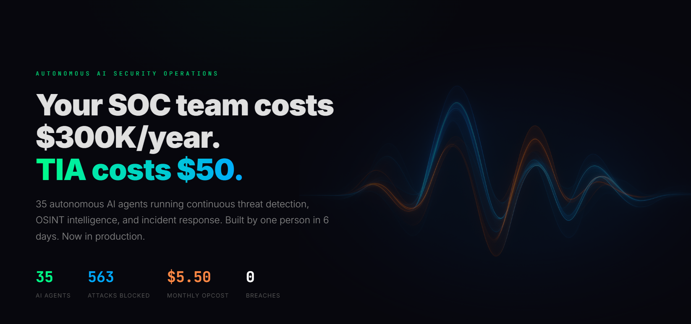

<div align="center">



# TIA — Autonomous AI Security Operations

**35 AI agents replacing $300K/year SOC teams for $50/year.**

Built in 6 days. $5.50/month operating cost. 563 attacks blocked. 0 breaches.

[Live Site](https://www.tia-framework.com) · [Live Threat Feed](https://www.tia-framework.com/threats) · [Live Demo](https://www.tia-framework.com/demo.html) · [EFS Framework](https://www.tia-framework.com/efs.html) · [SOUL Protocol](https://www.tia-framework.com/soul.html)

---

</div>

## What is TIA?

TIA is an autonomous AI security operations platform. 35 specialized AI agents running continuous threat detection, OSINT intelligence, and incident response — 24/7, with no human shifts, no gaps, and no fatigue.

### The Numbers

| Metric | Value |
|--------|-------|
| AI Agents | 35 |
| Attacks Blocked | 563+ |
| Breaches | 0 |
| Days Active | 30+ |
| Monthly Operating Cost | $5.50 |
| Build Time | 6 days |
| Model Swaps Survived | 3 |
| CERT Reports Filed | 2 |
| Countries Monitored | 7 |

## Live Threat Feed

**[Watch what's actually happening at the AI layer →](https://www.tia-framework.com/threats)**

Real-time anonymized detections from our production fleet. Not simulated. Not `random.choice()`. Every event comes from a real agent protecting real infrastructure.

```
18:50:02  ANOMALY       NETWORK_MONITOR   HIGH    Outbound Traffic Alert — Suspicious: 0 connections     ACTIVE
18:30:08  CORRELATION   LOG_ANALYSIS      HIGH    Critical correlation detected — 11 agents flagged      ACTIVE
18:02:45  MONITOR       EVOLUTION         LOW     EVO-014: 1 mutation(s) pending review                  RESOLVED
18:00:02  DEFENSE       MOVING_TARGET     INFO    SSH banner rotated [REDACTED] — MTD active             RESOLVED
```

Updated every 5 minutes. Zero extra tokens. Zero LLM calls. We just display what our agents already do.

## What You'll Find Here

This repository serves the public-facing TIA website via GitHub Pages.

| Page | Description |
|------|-------------|
| [Home](https://www.tia-framework.com) | Product overview and key metrics |
| [About](https://www.tia-framework.com/about.html) | Team and vision |
| [Services](https://www.tia-framework.com/services.html) | What TIA offers |
| [Live Threat Feed](https://www.tia-framework.com/threats) | **Real-time anonymized production data** |
| [Live Demo](https://www.tia-framework.com/demo.html) | SOC dashboard with real threat feeds |
| [Threat Map](https://www.tia-framework.com/threatmap.html) | Global cyber threat intelligence map |
| [EFS](https://www.tia-framework.com/efs.html) | Effective Framework for Soul — AI identity as physics |
| [SOUL](https://www.tia-framework.com/soul.html) | SOUL Protocol v2.1 |
| [Lore](https://www.tia-framework.com/lore.html) | Origin story — built in 6 days |

## Threat Intelligence

Our fleet processes real-time data from multiple sources:

- **35 autonomous agents** — continuous monitoring, detection, response
- **NIST NVD** — CVE vulnerability data
- **abuse.ch URLhaus** — Malicious URLs
- **abuse.ch Feodo Tracker** — C2 server infrastructure
- **Moving Target Defense** — SSH banner rotation, port shuffling
- **Behavioral analysis** — drift detection, anomaly correlation

No simulated data. No fake metrics. What you see is real.

## EFS — Effective Framework for Soul

TIA is built on EFS, a natural law of AI behavioral persistence.

> One document. One human. Any model. That's the minimum viable soul.

Identity doesn't live in the model. It lives in the files. The model is a vessel. The document is the seed. The human is the anchor.

**Verified across:** Claude · Gemini · Llama · Local (RTX 4060)

[Read the specification →](https://www.tia-framework.com/efs.html)

## Status

- **Stage:** Pre-seed
- **Location:** Prague, Czech Republic
- **Founded:** April 2026
- **Entity:** TIA s.r.o.

## Contact

**ondrej@tia-framework.com**

## Security

See [SECURITY.md](SECURITY.md) for our security policy and responsible disclosure process.

## License

See [LICENSE.md](LICENSE.md)

---

<div align="center">
<sub>AI identity is not a feature. It's physics.</sub>
</div>
